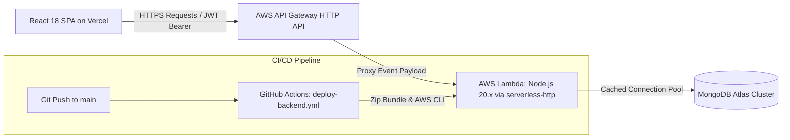

# Money Manager – Backend API 💸

A secure, scalable RESTful API and serverless microservice for personal and business finance management. Built with Node.js, Express, MongoDB Atlas, and deployed to AWS Lambda behind API Gateway with automated GitHub Actions CI/CD.

---

## 🔗 Links

- **Live Application (Vercel)**: [https://moneymanager-harshit.vercel.app](https://moneymanager-harshit.vercel.app)
- **Frontend Repository**: [https://github.com/Harshit-Patle/money-manager-frontend](https://github.com/Harshit-Patle/money-manager-frontend)

---

## 📌 Overview & Problem Statement

Individuals and small businesses often struggle with fragmented financial tracking—lacking clear separation between personal and office expenses, account-to-account visibility, and safeguards against inadvertent modifications to historical ledgers.

The **Money Manager API** provides a centralized, secure backend that:
1. Isolates records on a per-user basis with strict JWT authentication.
2. Segregates transactions across **Personal** and **Office** divisions.
3. Supports multi-account fund tracking (**Cash**, **Bank**, **Wallet**).
4. Enforces a **12-hour modification rule** to preserve financial data integrity.
5. Employs a **dual-target serverless architecture** that runs identically in local Node.js development and on AWS Lambda in production.

---

## 🏗️ High-Level Architecture



---

## ✨ Key Features

### 1. Authentication & Security
- **Registration Validation**: Enforces valid email formats, lowercase/trim normalization, and minimum password length ($\ge 6$ characters).
- **Password Security**: Bcrypt hashing with automated salt generation.
- **JWT Authorization**: Stateless token verification (`Authorization: Bearer <token>`) with automatic expiration.
- **Mass Assignment Protection**: Strict update whitelisting (`amount`, `category`, `division`, `account`, `description`) and query scoping (`userId: req.user.id`).

### 2. Transaction Management & Business Rules
- **Income & Expense CRUD**: Full lifecycle management with numeric validation and categorical tagging.
- **12-Hour Integrity Lock**: Enforces a strict 12-hour rule—transactions older than 12 hours cannot be edited or deleted.
- **Division Segregation**: Filter transactions between `Personal` and `Office`.

### 3. Multi-Account Transfers
- **Dedicated Transfer Schema**: Tracks fund movements between `Cash`, `Bank`, and `Wallet` accounts.
- **Validation**: Prevents transferring funds between the same source and destination account.

### 4. Advanced Analytics & Aggregations
- **Category Summary**: MongoDB aggregation pipeline grouping expenses and income by category.
- **End-of-Day Date Filtering**: Correctly includes transactions across full UTC boundaries (`23:59:59.999Z` for `YYYY-MM-DD` inputs).

---

## 🛠️ Actual Tech Stack

| Layer | Technology | Purpose |
|---|---|---|
| **Runtime** | Node.js (v20.x) | JavaScript runtime engine |
| **Framework** | Express.js 5.x | REST API routing and middleware |
| **Database** | MongoDB Atlas via Mongoose 9.x | Document database and object data modeling |
| **Authentication** | JSON Web Tokens (`jsonwebtoken`) & `bcryptjs` | Stateless authentication and password hashing |
| **Serverless Adapter** | `serverless-http` | Wraps Express app for AWS Lambda & API Gateway |
| **Cloud Compute** | AWS Lambda | Serverless execution |
| **API Gateway** | AWS API Gateway (HTTP API) | Managed API proxy & CORS handling |
| **CI/CD** | GitHub Actions | Automated build, package, and deployment pipeline |

---

## 🧠 Important Technical Decisions

1. **Dual-Target Express Architecture**:
   - `app.js`: Exports the pure Express instance (routes, middleware, 404, and centralized error handler) without binding to a network port.
   - `server.js`: Standard local runner (`app.listen(PORT)`) for local development.
   - `lambda.js`: Production serverless adapter utilizing `serverless-http`.

2. **MongoDB Connection Caching in Serverless**:
   - To avoid connection exhaustion and reduce cold-start latency, `config/db.js` caches the Mongoose connection promise and checks `readyState >= 1` before connecting.
   - Sets `context.callbackWaitsForEmptyEventLoop = false` to allow Lambda to freeze background database event loops immediately upon responding.

3. **Safe Error Handling**:
   - Centralized 4-argument Express error middleware sanitizes internal errors and prevents stack traces or raw database exceptions from leaking to clients.

---

## 🔐 Environment Variables

The backend uses the following environment variables (template available in [`.env.example`](file:///.env.example)):

| Variable | Description | Example / Format |
|---|---|---|
| `PORT` | Local server port | `5000` |
| `MONGO_URI` | MongoDB Atlas connection string | `mongodb+srv://<user>:<pass>@<cluster>.mongodb.net/<db>?retryWrites=true&w=majority` |
| `JWT_SECRET` | Secret key for signing and verifying tokens | `your_strong_jwt_secret_key` |

---

## 📦 Local Run Instructions

### Prerequisites
- Node.js (v18 or v20+)
- MongoDB Atlas cluster or local MongoDB instance

### Steps
1. **Clone the repository**:
   ```bash
   git clone https://github.com/Harshit-Patle/money-manager-backend.git
   cd money-manager-backend
   ```

2. **Install dependencies**:
   ```bash
   npm install
   ```

3. **Configure environment**:
   ```bash
   cp .env.example .env
   # Edit .env and supply your MONGO_URI and JWT_SECRET
   ```

4. **Start development server**:
   ```bash
   npm run dev
   ```
   API runs at `http://localhost:5000`.

---

## 👤 Pre-Seeded Demo Account

| Email | Password | Access |
|---|---|---|
| `demo.user@moneymanager.com` | `Password@123` | Pre-populated with income, expense, and transfer records |

---

## ⚠️ Known Limitations

- **Serverless Cold Starts**: Initial invocation after a period of inactivity may take 1–2 seconds while AWS provisions the container and connects to MongoDB Atlas.
- **12-Hour Modification Window**: Past transactions older than 12 hours cannot be modified (enforced by design for audit integrity).
